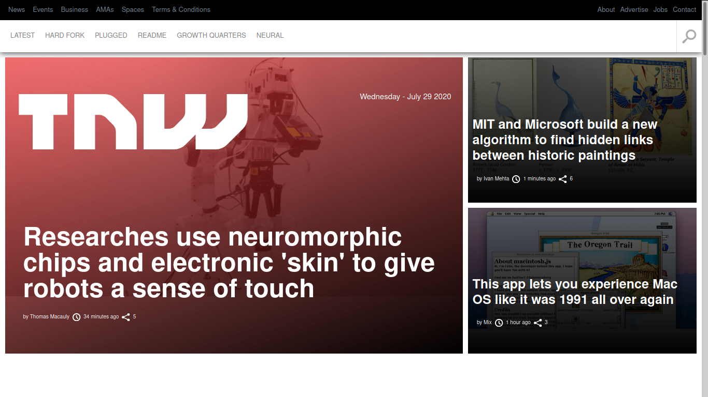

# Building-with-Responsive-Design

Building an HTML and css page that matches the appearance of this page [TNW](https://thenextweb.com/)

  

# Built With

- [HTML](https://developer.mozilla.org/en-US/docs/Web/HTML)
- [CSS](https://www.w3schools.com/css/)
- [Icomoon](https://icomoon.io/)

# Live Demo

[Click here for Live Demo]()

# Getting Started

# Authors

### Jose Abel Ramirez Frontany

- Github: [@jose-Abel](https://github.com/jose-Abel)
- Linkedin: [Jose Abel Ramirez Frontany](https://www.linkedin.com/in/jose-abel-ramirez-frontany-7674a842/)

### Jhonatan Sarrazola

- Github: [@jssarrazolaa](https://github.com/jssarrazolaa)
- Linkedin: [Jhonatan Sarrazola](https://www.linkedin.com/in/jhonatan-sarrazola-6a46a01a5/)

# Contributing

Contributions, issues and feature requests are welcome!
Feel free to check the [issues page](https://github.com/jssarrazolaa/Building-with-Responsive-Design/issues).

# Show your support

If you like our work, please give us a :+1:

# Acknowledgments

- Microverse
- W3schools
- Freecodecamp
- Developer.mozilla
- Learnshayhowe
- Odin project

# License

This project is [MIT](https://opensource.org/licenses/MIT) licensed.
